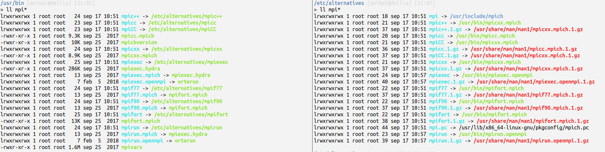
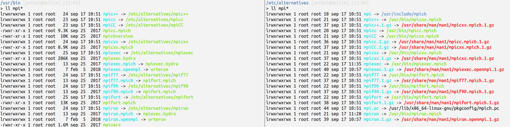

# Reinstalation Manual
Guide to install all the tools I need

## MPI

### MPICH

```
sudo apt-get install mpich
```

### Open MPI
```
sudo apt-get install openmpi-common
sudo apt-get install libcr-dev libopenmpi-dev openmpi-bin openmpi-doc
```
## Paraview

```
sudo apt-get install paraview  
```

Note: this also installs openMPI which can unset the proper behavior of mpi because it changes the binary link from mpirun. You need to make sure that the mpirun and mpirc++ point both to the same distribution.

1. check the links on the bin
```
cd /usr/bin && ll mpi*
cd /etc/alternatives && ll mpi*
```
The wrong configuration will be as follows (look how mpic++ is pointing to mpich and mpiexec to openmpi):


To fix this run:
```
cd /etc/alternatives && sudo unlink mpirun && sudo ln -s /usr/bin/mpirun.mpich mpirun
cd /etc/alternatives && sudo unlink mpiexec && sudo ln -s /usr/bin/mpiexec.mpich mpiexec
```


## HDF

sudo apt-get install libhdf5-mpich-dev

## PETSC

Errase the hole directory and then 
./configure --with-cc=mpicc --with-cxx=mpic++ --with-fc=mpif90 --download-fblaslapack --with-mpi-dir=/usr/lib/openmpi/include
